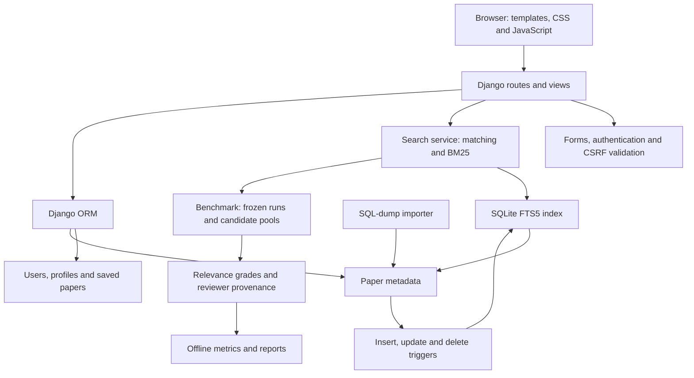

# Scholarly: CS547 scholarly search

## Project overview

Scholarly is a local scholarly search application built with Django, SQLite
FTS5, server-rendered templates, and vanilla CSS/JavaScript. Users search academic
paper metadata, refine results, read abstracts, export citations, and maintain a
private saved-paper library. The application does not host full-text PDFs; it
links to the original paper repository.

The bundled arXiv SQL dump contains 15,249 source rows. Exact-URL deduplication
produces 14,748 distinct records, dated from May 1992 through November 2024.
The corpus is a static collection, not a live or comprehensive scholarly index.
Different arXiv versions and URL variants are not automatically merged.

## Architecture



Paper stores title, abstract, authors, publication date and a unique URL. SavedPaper
links a user to a paper with a uniqueness constraint on that pair. Profile stores
a user's research area but does not affect relevance ranking. PaperRedirect maps
removed duplicate IDs to surviving papers so old links continue to work. Account
authentication and password hashing use Django's authentication system.

The importer parses the supported dump format without executing its SQL. Repeated
imports update records by URL. Database triggers maintain the FTS index when paper
metadata changes. The application uses an ignored local database rather than
modifying the original source dump or tracked legacy database.

## Retrieval method

Queries are normalized to lowercase Unicode alphanumeric tokens. Search supports:

| Mode | Matching rule |
| --- | --- |
| Any words, default | At least one query term matches |
| All words | Every term matches, possibly across metadata fields |
| Exact phrase | Terms occur adjacently and in order within one field |

FTS5 uses Porter stemming, so related word forms match in every mode. Exact phrase
is a token-sequence match, not a literal case-sensitive substring. Punctuation is
ignored; typed quotes and Boolean operators do not enable query syntax. Matching
uses at most 40 terms. Phrase mode preserves repeated words.

Results use SQLite's BM25 with title/abstract/author weights of 5/1/2. Lower FTS5
BM25 values sort first. Ties use publication date descending, then database ID
ascending. Users can instead sort by newest publication. Scores are ranking
signals, not probabilities of relevance.

Year filters support inclusive Since year and exact In year matching. A valid
year without keywords browses that period newest first. Homepage chart bars
select their exact year. Results paginate in groups of ten. Queries, filters,
matching mode, sorting and page are represented in URLs.

## User workflows

Search and abstract reading are public. Users can register, log in and save or
remove papers. Saved libraries are private to each account and filter by title
or author. Citation copy and download produce BibTeX from stored metadata.
Reader links preserve the originating search or library URL through login,
save/remove actions and legacy-ID redirects. Return destinations are restricted
to allowed local list routes.

The responsive interface follows the design references in assest/. It includes
mobile navigation, empty and validation states, keyboard focus, search shortcuts,
and a desktop preview pane. Mock reference features such as citation graphs and
live harvesting were not presented as implemented capabilities.

## Evaluation

Both studies use a single Codex AI assessor reading stored titles and abstracts.
Grades are 0 irrelevant, 1 partial/background, and 2 directly relevant, with a
reason per query-paper pair. These judgments are provisional: they are not human
ground truth, full-text assessment, or independent validation. The assessor also
implemented the benchmark. Candidate order was shuffled, and saved system ranks
were not inspected while grading.

Precision@10 counts grades 1 and 2 as relevant and always divides by ten. MRR@10
uses the first positive result. nDCG@10 uses exponential gains of 0, 1 and 3.
Recall is measured against relevant entries in the pooled top-ten candidates,
not all relevant documents in the corpus. Reports retain per-query results and
identify the frozen corpus and judgments with SHA-256 fingerprints.

### Study 1: field weighting

Twelve predeclared intents produced 167 pooled pairs comparing weighted BM25
with uniform-field BM25 under identical Any words matching.

| Ranker | Precision@10 | MRR@10 | nDCG@10 | Pooled recall@10 |
| --- | ---: | ---: | ---: | ---: |
| Weighted, 5/1/2 | 0.8167 | 0.9583 | 0.7931 | 0.7334 |
| Uniform, 1/1/1 | 0.8417 | 0.9583 | 0.8811 | 0.7820 |

Uniform weighting performed better on these AI judgments. That result motivates
further weight evaluation; it does not establish a universal advantage. The
production search weights remain unchanged.

### Study 2: matching modes

Six fresh intents, distinct from Study 1, produced 91 pooled pairs. We fixed
weighted BM25 throughout. Matching changes both candidate eligibility and FTS5
scoring, so this evaluates complete mode behavior.

| Mode | Precision@10 | nDCG@10 | Empty queries | Mean returned@10 |
| --- | ---: | ---: | ---: | ---: |
| Any words | 0.5333 | 0.6876 | 0/6 | 10.00 |
| All words | 0.5000 | 0.7457 | 0/6 | 7.67 |
| Exact phrase | 0.4833 | 0.6999 | 1/6 | 5.50 |

All words improved average nDCG, while Any words had higher Precision@10 and
returned more results. Exact phrase helped established terms such as object
detection but returned nothing for privacy preserving medical data. We retained
Any words as the default and exposed the stricter modes as refinements.

The studies use different query sets and pools; their absolute scores should not
be compared as before/after improvement. Neither query set is a random sample of
users. No statistical-significance claim is made. Reusing these queries to tune
the system would require a separate evaluation set for subsequent claims.

Full evidence: [weighting study](benchmarks/pilot-ai-20260924/README.md) and
[matching study](benchmarks/matching-20260924/README.md).

## Five-minute demonstration

1. Open the homepage. Explain the static corpus and click a publication-year bar.
   Confirm In year is selected and explain that no keyword is required.
2. Search for machine translation. Switch between Any words, All words and Exact
   phrase using Apply filters. Explain the coverage/relevance tradeoff without
   promising particular counts on a different corpus.
3. Open a paper and use its return link. Show that the query and filters remain.
   If results span multiple pages, repeat from page two.
4. Log in with a locally created demo account, save a paper, view My Library and
   remove the saved item. Do not include passwords in the submission or screenshots.
5. Open the reader, copy BibTeX and download the citation. Follow the original
   repository link to explain the boundary between metadata and full text.
6. Search for zzzznonexistenttopic to show the empty state. At a narrow viewport,
   demonstrate the menu and Escape key. On the results page, demonstrate slash
   to focus search and j/k to move among titles.
7. Show the two evaluation tables and explicitly disclose AI-generated judgments.
   Close with the retained default and the remaining evaluation limitations.

## Reproduce and verify

Follow [README.md](README.md) for virtual environment setup, dependencies,
migrations, import and runserver. SQLite must support FTS5. Back up an existing
database before migrations: account conversion and duplicate consolidation are
intentionally irreversible.

```powershell
.\.venv\Scripts\python.exe scholar_search/manage.py test search
.\.venv\Scripts\python.exe scholar_search/manage.py check
.\.venv\Scripts\python.exe scholar_search/manage.py makemigrations --check --dry-run
```

Backend coverage includes matching semantics, ranking, filters, index maintenance,
authentication, account isolation, CSRF, imports, duplicate handling, navigation,
citations and benchmark validation. Chrome tests use a disposable database and
cover five responsive widths, keyboard actions, login/save/navigation flows,
matching modes and citations. See [QA_REPORT.md](QA_REPORT.md) for current results
and the completed Firefox/WebKit smoke checks. Their coverage is narrower than
the Chrome suite. The 200% reflow test models the reduced viewport, not native zoom controls.

## Remaining work

- Independent human relevance judgments and a larger representative query set.
- Broader Firefox/WebKit interaction coverage, screen-reader testing and physical mobile testing.
- Query spelling correction, synonym handling, identifiers and richer search syntax.
- Password recovery, throttling, production hosting, monitoring and backup procedures.
- A documented corpus refresh policy and reliable citation metadata before graphs.

Submission should include source code, migrations, requirements, setup instructions,
this document, and benchmark packets/reports. Exclude the local user database,
virtual environment, downloaded browsers, backups and temporary test artifacts.
Confirm any course-specific rubric and required student identification before
handing in; no rubric or required report template was supplied for this document.
